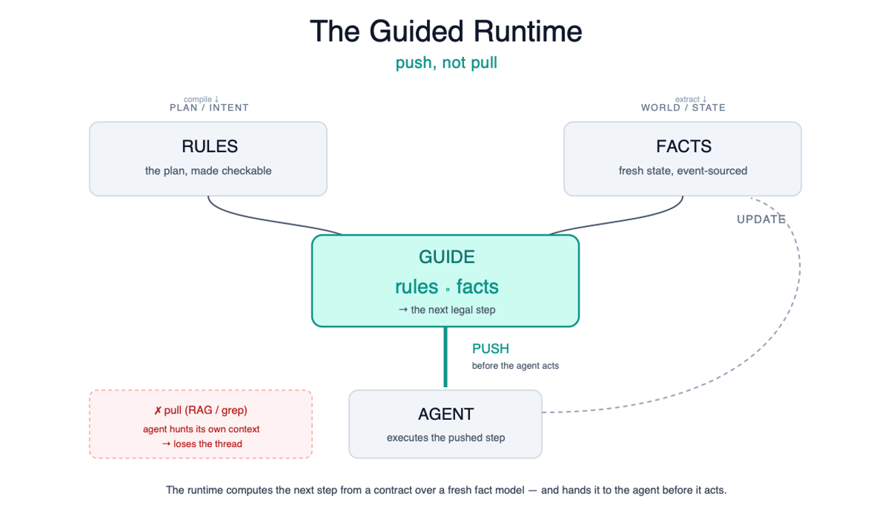

# Aming Claw

**Push, not pull: a guided runtime for AI agents.**

Aming Claw is a local-first governance layer for AI-coded development. It
keeps an agent on track by pushing the current role, contract, next legal
action, required evidence, and verification gate before the agent acts.

That is the core move from the public article:
[Push, not pull: your AI agent shouldn't fetch its own context](https://dev.to/amingin_ai/push-not-pull-your-ai-agent-shouldnt-fetch-its-own-context-2kkf).
Search, grep, RAG, and repo maps still matter, but they are fact-layer tools.
They should not be the control loop for an agent that is already drifting.



## Status

Aming Claw is a V1 MVP and active dogfood system. The guided-runtime direction
is mid-migration: more work is moving from agent-pulled context into
runtime-pushed contracts, gates, and evidence. The current evidence is
observational, not a validated benchmark claim.

Today it is useful for local AI development governance:

- Local dashboard for backlog, activity, graph, review queues, and runtime
  evidence.
- MCP tools for agents to query live project state instead of relying on chat
  memory.
- Commit-bound project graph and event-sourced runtime/timeline evidence.
- Onboard service that selects the role, work type, token refs, and next
  contract path.
- Direct-fix and parallel-work paths for governed implementation.

## Install

Use the host you work in, then reload or open a new host session after install.
Plugin files on disk do not automatically appear inside an already-running AI
host conversation.

### Codex One-Shot

Ask Codex:

```text
One-shot install and open dashboard for Aming Claw from https://github.com/amingclawdev/aming-claw
```

Install-only refresh:

```bash
aming-claw plugin install https://github.com/amingclawdev/aming-claw
aming-claw plugin doctor
```

### Claude Code One-Shot

Paste this into Claude Code:

```text
Install aming-claw end-to-end from https://github.com/amingclawdev/aming-claw:
1. Run `/plugin marketplace add https://github.com/amingclawdev/aming-claw`
2. Run `/plugin install aming-claw@aming-claw-local`
3. pip install -e the marketplace clone at
   ~/.claude/plugins/marketplaces/aming-claw-local
   (Windows: %USERPROFILE%\.claude\plugins\marketplaces\aming-claw-local)
4. Start `aming-claw start` in a background terminal
5. Run `aming-claw open` to launch the dashboard
6. Remind me to reload Claude Code so the plugin's MCP tools and skills load
```

Manual Claude Code install:

```text
/plugin marketplace add https://github.com/amingclawdev/aming-claw
/plugin install aming-claw@aming-claw-local
```

Then install the runtime package and start governance:

```bash
cd ~/.claude/plugins/marketplaces/aming-claw-local
pip install -e .
aming-claw start
aming-claw open
```

### Verify

```bash
aming-claw plugin doctor
aming-claw start
aming-claw open
```

Open:

```text
http://localhost:40000/dashboard
```

The root path `/` is not the dashboard and may return `404`. If governance
health is OK but `/dashboard` is unavailable, dashboard static assets are
missing; see [Codex bootstrap details](docs/install/codex-bootstrap.md) and the
[legacy README archive](docs/archive/README-legacy-20260701.md).

## How It Works

The runtime shape is:

```text
Facts + Rules -> Guide
```

- **Facts** are fresh, queryable ground truth: commit-bound graph state,
  backlog rows, task timeline events, accepted review decisions, runtime
  projections, and current service health.
- **Rules** are plans compiled into checkable contracts: allowed files,
  blocked actions, actor roles, required evidence, QA requirements, merge
  policy, reconcile requirements, and close gates.
- **Guide** is the runtime steering signal: current contract id, actor role,
  allowed and blocked actions, next legal action, required evidence, payload
  skeleton, state watermark, and the gate that will verify the action.

The agent still reasons. The difference is that it no longer has to rediscover
"where am I, what role do I have, and what is legal next?" from scratch.

## Active Entry Point

Use one active skill entrypoint:

```text
aming-claw-onboard
```

From there, prefer MCP:

```text
onboard_route_guide(project_id="<project>", role="<role>", work_type="<work type>", backlog_id="<row>")
```

The guide confirms:

- role: observer, worker, mf_sub, or QA
- work type: direct fix, parallel worker, multi-backlog parallel, QA, system
  operation, capability query, or continue contract chain
- required identity: session id, route token refs, QA token refs, or worker
  fence/session refs
- next legal action and the successor contract/interface
- graph-first and backlog/contract-chain context

Archived skills live under `Archive/skills/` for provenance only. They are not
active instructions.

## Direct Fix

Use direct fix when the runtime says the current path is blocked, or when the
operator explicitly approves a tiny parentless repair.

There are two different cases:

1. **Parentless direct repair**: a small operator-approved fix, usually docs or
   a tightly scoped runtime unblock. Record `observer_direct_mutation_exception`
   evidence before editing.
2. **Blocked-parent successor**: a parent contract is blocked, so
   `direct_fix_enter` creates a child fix contract. Finish the child, run
   independent QA, then return to the parent.

Minimal operator-supervised direct-fix flow:

```text
1. File or select the backlog row.
2. Call onboard_route_guide with role=observer and work_type=operator_supervised_direct_main or direct_fix.
3. Register/renew observer session and route token ref.
4. Record pre-mutation direct-fix exception evidence.
5. Create a branch and edit only the approved target files.
6. Record implementation evidence with changed files and verification commands.
7. Run independent QA or verification for the same evidence packet.
8. Commit the branch.
9. Reconcile the current commit after merge.
10. Close the backlog row only through the protected close path.
```

Do not persist raw session tokens or raw route tokens in files, timeline events,
or backlog rows. Use copy-safe token refs.

For runtime-code direct fixes, validate from the fixed branch service before
returning to the parent path. For docs-only fixes, branch-service validation is
usually unnecessary; Markdown/link checks and independent doc QA are the useful
evidence.

## Parallel Work

Use parallel work when one backlog row needs bounded workers, or when multiple
compatible backlog rows can be developed together.

- `mf_parallel`: one backlog row, multiple bounded lanes or one bounded worker
  plus QA.
- `mf_batch_parallel`: a parent coordination row with multiple child backlog
  rows.

Parallel is still serial at shared-state boundaries. Workers can implement in
parallel, but merge, graph reconcile, redeploy, and close are ordered.

Minimal parallel flow:

```text
1. File the parent or row-scoped backlog.
2. Call onboard_route_guide with work_type=parallel_worker or multi_backlog_parallel.
3. Let the runtime calculate overlap and file/worktree fences.
4. Allocate each worker branch/runtime context.
5. Workers read the runtime worker guide before editing.
6. Workers record read receipt, startup, graph trace, implementation evidence, and finish gate.
7. Independent QA verifies each worker packet.
8. Materialize the durable merge queue item.
9. Apply the merge queue in order.
10. Reconcile once against the final current commit.
11. Close rows through protected close.
```

The useful invariant: workers finish into the merge queue; they do not merge,
close, mutate graph state, or silently widen scope.

## Dashboard

Start governance, then open:

```bash
aming-claw start
aming-claw open
```

The dashboard shows:

- **Activity**: current runtime/timeline stream and playback history.
- **Backlog**: requirements, rows, scope, runtime state, and close status.
- **Graph**: commit-bound files, functions, relations, tests, docs, and config.
- **Operations Queue**: graph reconcile, semantic jobs, and retryable work.
- **Review Queue**: AI proposals waiting for human accept/reject.
- **AI Config**: local `codex` or `claude` routing for optional AI enrich.

## Demos

- [Demo map](docs/demos/README.md)
- [Vibe Queue Demo](docs/vibe-queue-demo/README.md)
- [Docs Drift Demo](docs/drift-demo/README.md)
- [Backlog Duplicate Demo](docs/backlog-dupe-demo/README.md)
- [HN Multi-Agent Challenge Demo](docs/hn-demo/README.md)

The preferred demo path is a live Claude Code or Codex session acting as the
observer. Fixture scripts are setup and release-check helpers, not a substitute
for a live observer route.

## Public Articles

Start with the current thesis:

- [Push, not pull: your AI agent shouldn't fetch its own context](https://dev.to/amingin_ai/push-not-pull-your-ai-agent-shouldnt-fetch-its-own-context-2kkf)

Earlier articles and context:

- [Route Context: How I Built Right Context for Agents](https://dev.to/amingin_ai/route-context-how-i-built-right-context-for-agents-3i1)
- [AI proposed 5 components for my parallel system. After walking one scenario, only 3 were real.](https://dev.to/amingin_ai/ai-proposed-5-components-for-my-parallel-system-after-walking-one-scenario-only-3-were-real-12nd)
- [I told my AI to build a feature. Did it? I had no idea.](https://dev.to/amingin_ai/i-told-my-ai-to-build-a-feature-did-it-i-had-no-idea-1f1)
- [Legacy README archive](docs/archive/README-legacy-20260701.md)

## Documentation

- [Onboarding Guide](docs/onboarding.md)
- [Architecture](docs/architecture.md)
- [Deployment](docs/deployment.md)
- [Governance Overview](docs/governance/README.md)
- [Configuration Reference](docs/config/README.md)
- [API Overview](docs/api/README.md)
- [Codex Bootstrap Scripts](docs/install/codex-bootstrap.md)

## License

Aming Claw is licensed under the Functional Source License, Version 1.1, MIT
Future License (FSL-1.1-MIT). See [LICENSE](LICENSE).
