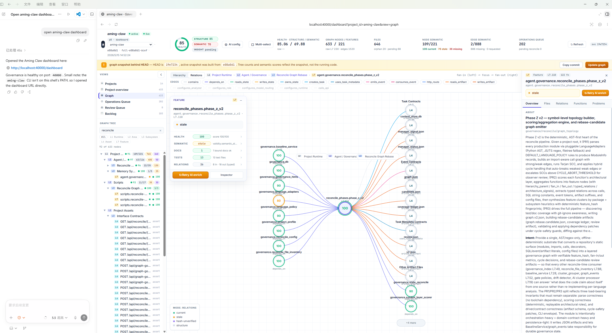
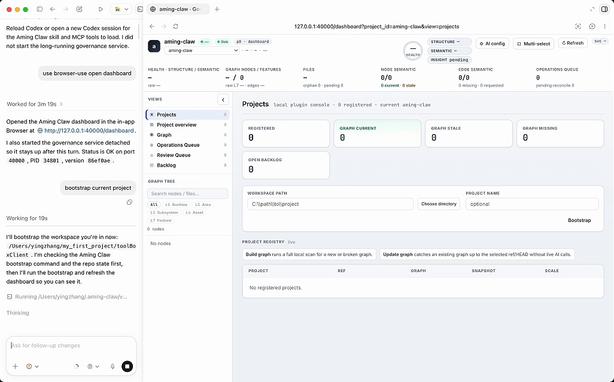

# Aming Claw

**Your AI agent and you, sharing the same dashboard.**

Open source workspace for AI-coded development. See what AI is touching in
real-time, audit every change, review proposals before they land in your
codebase. Multi-language (Python/TypeScript), MCP-native, local-first.



## Contents

- [Quick Start](#quick-start)
- [Key Terms](#key-terms)
- [Demos](#demos)
- [Use Cases](#use-cases)
- [V1 MVP Snapshot](#v1-mvp-snapshot)
- [Install Details](#install-details)
- [Runtime Boundaries](#runtime-boundaries)
- [Plugin Components](#plugin-components)
- [Workflow](#workflow)
- [CLI](#cli)
- [Packaging](#packaging)
- [Governance Contract](#governance-contract)
- [Status & Contributing](#status--contributing)
- [Documentation](#documentation)
- [License](#license)

## Quick Start

Start with the AI host you use. The longer requirements, raw installer commands,
and troubleshooting notes are in [Install Details](#install-details).

### Codex

Ask Codex to install from the GitHub repo:

```text
Install the Aming Claw plugin from https://github.com/amingclawdev/aming-claw
```

If the `aming-claw` CLI is already available, you can run the same install
directly:

```bash
aming-claw plugin install https://github.com/amingclawdev/aming-claw
```

Reload Codex or open a new Codex session after install. First-run startup and
verification steps are in [Install Details](#install-details).

### Claude Code

Paste this once — Claude bootstraps the plugin end-to-end:

```text
Install aming-claw end-to-end from https://github.com/amingclawdev/aming-claw:
1. Run `/plugin marketplace add https://github.com/amingclawdev/aming-claw`
2. Run `/plugin install aming-claw@aming-claw-local`
3. pip install -e the marketplace clone at
   ~/.claude/plugins/marketplaces/aming-claw-local
   (Windows: %USERPROFILE%\.claude\plugins\marketplaces\aming-claw-local)
4. Start `aming-claw start` in a background terminal
5. Run `aming-claw open` to launch the dashboard
6. Remind me to reload Claude Code so the plugin's MCP tools and skills load
```

Steps 1–2 only copy the skill files; pip install adds the Python runtime,
`aming-claw start` boots governance on port `40000`, `aming-claw open`
launches the dashboard. After reloading, phrases like "install and start
aming-claw" or "one-shot install" trigger the launcher skill's one-shot
mode for re-bootstrap in future sessions. First-run troubleshooting and
raw installer scripts are in [Install Details](#install-details).

### After installation: open a new Claude Code session

The Claude Code session you installed Aming Claw in **won't** load the plugin's
skills or MCP tools — Claude Code reads plugin paths at session start, so
changes apply only to **new** sessions.

**Works immediately (no new session needed):**

- The `aming-claw` CLI on your `PATH`
- `aming-claw start` brings up governance on port `40000`
- The dashboard at `http://localhost:40000/dashboard`
- `aming-claw open` to launch a browser to it

**Requires a new session:**

- The `/aming-claw:aming-claw` and `/aming-claw:aming-claw-launcher` skills
- The `mcp__plugin_aming-claw_aming-claw__*` MCP tools (`health`,
  `runtime_status`, `task_*`, `backlog_*`, `graph_*`, etc.)

> **TL;DR**: After install, open a new Claude Code session to use Aming Claw
> *inside* your Claude Code conversations. The dashboard works in the current
> session.

This is a Claude Code framework behavior, not specific to Aming Claw — but it
surprises users often enough that we call it out.

## Key Terms

- **Commit-bound graph** — graph state pinned 1:1 to a specific git commit; queries return what was true at that commit. The snapshot id encodes the commit (e.g. `scope-aefef99-a554`).
- **Manual Fix (MF)** — the audit-trailed change workflow: predeclare a backlog row → graph-first discovery → scoped edit → focused tests → commit with Chain trailers → graph reconcile → close the row. V1's default implementation path in place of chain automation.
- **Update Graph / scope reconcile** — re-materialize the graph snapshot to track new commits. Triggered after a Manual Fix lands so subsequent queries see the latest code.
- **Operations Queue** — dashboard view of in-flight graph operations: snapshot builds, semantic enrichment jobs, reconcile work, governance hint patches.
- **Review Queue** — dashboard view where AI-proposed semantic memories wait for human accept/reject; nothing becomes trusted project memory until an operator approves.
- **Governance Hint** — graph mutation written as a comment in a tracked file (committed, then applied at the next reconcile). Source-controlled, reversible, audit-trailed — the only safe way to bind orphan doc/test/config files to nodes.
- **AI Enrich** — request the AI provider to generate a semantic summary/intent/risk for selected nodes or edges. Proposals land in Review Queue; the AI provider is the local `claude` or `codex` CLI (see [AI Providers](#ai-providers)).

## Demos

Recorded clips of the V1 workflows.

### Install and verify


URL drop → `aming-claw plugin doctor` → `aming-claw start` → open `/dashboard`.

### Bootstrap a project



Choose a clean project, build the graph, watch nodes appear in Projects/Graph.

### Inspect code through the graph


Select a node, open Files / Functions / Relations, jump to a function line in the editor.

### Find a PR opportunity


Use low health, missing tests/docs, or high fan-out to file a graph-backed backlog row.

### AI Enrich review


Run targeted AI Enrich, watch Operations Queue, then accept or reject the Review Queue proposal.

### Governance Hint


Bind an orphan doc/test/config file to a node, commit the hint, run Update Graph.

## Use Cases

### Govern AI-assisted fixes

For V1, use Manual Fix rather than chain automation for normal implementation:
file/update backlog, inspect the graph first, edit only scoped files, run
focused tests, commit with evidence, then Update Graph.

### Hand off work between AI agents

Use graph, backlog, queue state, and commit evidence as the shared project
ledger between Codex, Claude Code, and future agent workers. One AI can file a
backlog row, another can inspect the same graph evidence, implement a scoped
fix, and a third can review or continue the task without depending on fragile
chat history.

### Share the dashboard view with an AI agent

Keep the dashboard open while Codex or Claude Code uses MCP graph tools. The
human sees project health, graph structure, queue state, review proposals, and
backlog; the AI uses the same evidence to explain and act.

### Find credible PR opportunities

Use the graph to inspect unknown open-source projects, locate weak modules,
missing tests/docs, high fan-out functions, stale semantics, and isolated files.
Turn the evidence into backlog rows before implementing a focused PR.

### Review semantic memory before trusting it

Run AI Enrich on selected nodes or edges, then accept or reject the proposal in
Review Queue. `ai_complete` means the AI produced a proposal, not that the
project memory is trusted.

### Repair graph structure safely

Use Governance Hint to bind orphan doc/test/config files to an existing node.
The hint is written as source-controlled evidence and only takes effect after
commit plus Update Graph.

## V1 MVP Snapshot

Aming Claw V1 is focused on one practical loop: help a human and an AI agent
understand a local project through a commit-bound graph, find credible PR
opportunities, record them in backlog, and execute small governed fixes.

Stable V1 capabilities:

- Register a target project explicitly, then build or update its local graph.
- Explore nodes, files, functions, docs, tests, relations, fan-in/fan-out, and
  bounded source excerpts through the dashboard or MCP graph tools.
- Use the dashboard as a shared visual control plane for the user and AI
  session.
- File backlog rows with graph evidence and use Manual Fix discipline for
  implementation work.
- Run targeted AI Enrich on selected nodes or edges, then accept or reject the
  proposed semantic memory in Review Queue.
- Use Governance Hint to bind orphan doc/test/config files to existing nodes
  through source-controlled evidence.

V1 boundaries to keep visible:

- Chain dev/test/qa/merge automation is experimental. The recommended V1
  implementation path is Manual Fix with backlog-first, graph-first, tests,
  explicit commits, and Update Graph after commit.
- ServiceManager/executor degraded means chain automation is degraded; it does
  not mean governance, dashboard, graph query, or backlog are broken.
- Full semantic coverage is not required for V1. AI-generated semantics are
  proposals until reviewed and accepted.
- Function-level call queries exist for supported snapshots, but dashboard
  visualization is still evolving.
- Governance Hint is not arbitrary graph editing. It only binds orphan
  doc/test/config files that already appear in snapshot inventory.
- Plugin install, governance startup, dashboard availability, MCP visibility,
  ServiceManager health, and local AI CLI readiness are separate states.

Best-fit V1 use cases:

- Open-source contributors inspect unfamiliar projects through the graph, find
  evidence-backed improvement opportunities (missing tests/docs, high-coupling
  modules, stale semantics), and file focused PRs with graph-backed
  justification.
- AI agents use graph-first discovery instead of broad repository search when
  onboarding to an unfamiliar project.
- Maintainers use the dashboard to find missing tests/docs, high-coupling
  modules, stale semantics, and reviewable backlog items.
- A user and AI session share the same dashboard view while the AI performs
  MCP-backed graph, backlog, and semantic operations.

## Install Details

### First Run And Verify

Start governance in a separate terminal:

```bash
aming-claw start
```

Then open:

```text
http://localhost:40000/dashboard
```

Run the read-only check when you want to confirm the local install:

```bash
aming-claw plugin doctor
```

`aming-claw start` only starts the local governance service. It does not prove
that Codex/Claude loaded the plugin, MCP tools, dashboard static files,
ServiceManager, executor, or AI CLI auth.

### Requirements

- Python 3.9+
- Git
- Node.js/npm when rebuilding the dashboard from source
- Codex or Claude Code as the plugin host (loads skill + MCP tools)
- A working `claude` and/or `codex` CLI on `PATH` — Aming Claw's AI features
  (AI Enrich, semantic review, chain handlers that spawn AI sub-tasks) shell
  out to the local CLI rather than calling Anthropic/OpenAI directly. See
  [AI Providers](#ai-providers) below.

### AI Providers

AI-driven features in Aming Claw **call the local Claude Code or Codex CLI as
a subprocess** — Aming Claw does not make direct API calls to Anthropic or
OpenAI. As a consequence:

- You need a working `claude` and/or `codex` executable on `PATH`. Override
  the path with `CLAUDE_BIN` / `CODEX_BIN` env vars if needed.
- The CLI must be **logged in**. Aming Claw probes `--version` to confirm the
  binary exists, but cannot verify auth — `runtime_status` / `plugin doctor`
  report `auth unknown` until a real model call succeeds.
- Each project's AI config must declare a `semantic` provider/model
  (`GET /api/projects/{project_id}/ai-config`). `openai` routes use the Codex
  CLI; `anthropic` routes use the Claude Code CLI. AI Enrich is blocked if
  the semantic route is unset.
- `.env` `ANTHROPIC_API_KEY` / `OPENAI_API_KEY` are **not** consumed by AI
  Enrich — the local CLI's own auth is the source of truth.

If a CLI is missing or routing is unset, the dashboard's AI Enrich button
surfaces the specific reason (e.g., `missing`, `routing missing`); structural
graph queries, backlog, and Manual Fix still work without any AI CLI. See
[Runtime Boundaries](#runtime-boundaries) for the full state model.

If you are starting from a plugin host, give it the repository URL:

```text
Install the Aming Claw plugin from https://github.com/amingclawdev/aming-claw
```

For Codex, the lowest-friction path when `aming-claw` is not yet on `PATH` is
to ask Codex to install from GitHub (the [Quick Start](#quick-start) prompt
does this in one line). When you need the raw bootstrap script verbatim —
Windows PowerShell or macOS/Linux `curl` — see
[`docs/install/codex-bootstrap.md`](docs/install/codex-bootstrap.md).

### Claude Code install detail

In Claude Code, install from the Git URL:

```text
/plugin marketplace add https://github.com/amingclawdev/aming-claw
/plugin install aming-claw@aming-claw-local
```

Reload Claude Code or open a new session after install. Plugin install loads
plugin/skill assets and the MCP server declaration only — it does **not**
install Python dependencies, start governance, or prove MCP tools are visible
in the current session. To get a fully-working install (Python package + Codex
cache when relevant + doctor-verified), pair it with `aming-claw plugin
install <git-url>` from the CLI side, or use the clone fallback below if a
Claude Code sandbox blocks the remote URL.

If an older Aming Claw runtime is already installed, update the plugin checkout
directly:

```bash
aming-claw plugin install https://github.com/amingclawdev/aming-claw
aming-claw plugin doctor
```

If the host cannot install Git plugins directly yet, clone once and use the
repo-local package:

```bash
git clone https://github.com/amingclawdev/aming-claw.git
cd aming-claw
pip install -e .
```

Then start governance in a separate terminal and leave it running:

```bash
aming-claw start
```

If the `aming-claw` console script is not on `PATH` yet, run the same CLI
through Python: `python -m agent.cli start`.

After installing or updating the plugin, reload Codex or open a new Codex
session. Plugin load and governance startup are separate: `aming-claw start`
only starts the local governance service, while the Codex plugin/skill/MCP
must be loaded by Codex itself.

Run the read-only aftercare check when troubleshooting a fresh install:

```bash
aming-claw plugin doctor
```

Expected checks:

- `.codex-plugin/plugin.json` exists.
- `.agents/plugins/marketplace.json` contains `aming-claw`.
- Codex config enables `aming-claw@aming-claw-local`.
- Codex plugin cache contains
  `plugins/cache/aming-claw-local/aming-claw/<version>/.codex-plugin/plugin.json`.
- The generated Codex marketplace path is valid. A repo-local marketplace file
  may be reported as a compatibility warning; real Codex CLI loading uses the
  installed cache plus generated marketplace/config.
- `.claude-plugin/marketplace.json` schema: `plugins[].source` starts with
  `"./"` and `metadata.description` is present (`claude plugin validate`
  fails or warns otherwise).
- `.claude-plugin/plugin.json` schema: `name` + `version` + `description`
  present; if `mcpServers` is declared, basic shape is checked (command +
  args).
- `.mcp.json` contains `mcpServers.aming-claw`.
- Dashboard static assets are present, or doctor prints the exact build fallback.
- Local Codex/Claude CLI commands are detected when available; detection still
  reports AI auth as unknown.
- Governance health is reachable after services are started.
- `/dashboard` returns `200` when governance is running and static assets exist.
- ServiceManager is either reachable or reported as degraded for chain/executor.
- A new Codex or Claude Code session can see the Aming Claw skill and MCP tools.

Open the local launcher or dashboard:

```bash
aming-claw launcher --open-browser
aming-claw open
```

Dashboard URL:

```text
http://localhost:40000/dashboard
```

The root path `http://localhost:40000/` is not the dashboard and may return
`404`. If `/api/health` is OK but `/dashboard` returns `503`, governance is up
but dashboard static assets are missing. No build is needed when either
`agent/governance/dashboard_dist/index.html` or
`frontend/dashboard/dist/index.html` exists. For a raw checkout missing both:

```bash
cd frontend/dashboard
npm install
npm run build
```

## Runtime Boundaries

Keep these states separate when troubleshooting:

- Plugin assets installed on disk.
- Codex or Claude Code loaded the skill/MCP in the current session.
- Governance `/api/health` is running on port `40000`.
- Dashboard static assets are present and `/dashboard` returns `200`.
- ServiceManager responds on port `40101`.
- Executor/chain automation is available.
- Local AI CLIs are detected and the project has AI routing.

`aming-claw start` only starts governance. It does not prove the current
Codex/Claude session loaded the plugin, that dashboard assets exist, that
ServiceManager/executor are online, or that Codex/Claude CLI auth is valid.
Reload/open a new editor session after installing or updating plugin assets.

## Plugin Components

Aming Claw ships these assets in the repo:

- `.codex-plugin/plugin.json` + `.agents/plugins/marketplace.json` — Codex plugin + local marketplace
- `.claude-plugin/plugin.json` + `.claude-plugin/marketplace.json` — Claude plugin + local marketplace
- `.mcp.json` — MCP server contract (read when the repo is opened as a workspace; the CLI installer also generates cache-aware overrides for plugin-mode loading)
- `skills/aming-claw/` — main governance skill
- `skills/aming-claw-launcher/` — onboarding/launcher skill

After install, the plugin exposes two skills (Claude Code namespacing shown):

- `/aming-claw:aming-claw`
- `/aming-claw:aming-claw-launcher`

### What `aming-claw plugin install` writes

The CLI installer (`aming-claw plugin install <git-url>` or
`python scripts/install_from_git.py <git-url>`) is not just a `git clone`:

- Clones/updates the plugin checkout under `~/.aming-claw/plugins/<slug>`.
- Installs the Python package (`pip install -e .`) so the CLI and MCP server
  are importable.
- Writes Codex config + a generated local marketplace + a versioned plugin
  cache at `~/.codex/plugins/cache/aming-claw-local/aming-claw/<version>/`
  that real Codex CLI startup reads.

Run `aming-claw plugin doctor` after install. If the cache or generated
marketplace is missing/inconsistent, doctor reports `fail` (not just `ok`).
A passing doctor verifies the on-disk install and generated config; still open
or reload a Codex/Claude session and confirm the skill/MCP tools are visible.
Use `aming-claw plugin update --check` to fetch the configured Git remote,
compare the installed checkout with the remote commit, and refresh the local
plugin update state. Use `aming-claw plugin update --apply` to fast-forward the
checkout, refresh the Python/Codex install surfaces, and write restart/reload
obligations for MCP, governance, or ServiceManager when changed files require
operator action. After completing those restarts/reloads, run
`aming-claw plugin update --check` again to mark the installed commit current.
Starting governance is a separate long-running service command; keep it in its
own terminal instead of expecting plugin install to start it. On Windows use a
separate shell such as `Start-Process powershell`; on macOS/Linux a detached
smoke command can use `nohup python3 -m agent.cli start`.

### Post-Install Verification

In a new Codex or Claude Code session, ask the AI to use the Aming Claw skill:

```text
Use the Aming Claw skill. Check runtime_status(project_id="<id>"), graph_status, and backlog before changing code.
```

Confirm visibility:

- Skills `/aming-claw:aming-claw` and `/aming-claw:aming-claw-launcher` resolve.
- MCP tool `mcp__aming_claw__health` returns `ok`.
- `runtime_status` returns aggregated governance + ServiceManager + version_check state.

Plugin install loads plugin/skill assets and the MCP server declaration; it
does not install Python dependencies (unless using the CLI installer above),
start governance, or validate AI CLI auth. Start governance separately with
`aming-claw start`. See [Runtime Boundaries](#runtime-boundaries) for the full
state model.

If a Claude Code sandbox blocks the remote installer script path, use the clone
fallback from [Install Details](#install-details) — that's an environment policy,
not a governance failure.

## Workflow

1. Clone and install Aming Claw.
2. Start the local governance service.
3. Load the Codex or Claude Code plugin.
4. Bootstrap or select a project in the dashboard.
5. Build or update the project graph.
6. Inspect nodes, files, functions, docs, tests, and relations.
7. Use AI Enrich on selected nodes or edges.
8. Review and accept or reject proposed semantic memory.
9. File backlog rows and PR opportunities with graph evidence.

Project bootstrap is explicit. Do not silently register a workspace just
because `/api/projects` is empty. Bootstrap writes Aming Claw registry/DB state,
scans the workspace, and builds a commit-bound graph snapshot through
`POST http://127.0.0.1:40000/api/project/bootstrap`; ServiceManager on `40101`
is not the bootstrap API. If the target workspace is a dirty git repo,
commit/stash first.

For Aming Claw internals, an active local `project_id="aming-claw"` graph is not
required for the plugin to be usable. Use `aming-claw://seed-graph-summary` as
the packaged MVP navigation map when no active self graph exists. Target/user
projects need bootstrap before graph-backed claims are available.

## CLI

```bash
aming-claw launcher        # write/open the local launcher
aming-claw plugin install  # clone/update local plugin assets from Git
aming-claw plugin update --check # check Git remote and refresh update state
aming-claw plugin update --apply # fast-forward plugin checkout and write restart obligations
aming-claw start           # start governance locally
aming-claw open            # open the dashboard
aming-claw status          # check governance health
aming-claw mf precommit-check # run manual-fix plugin update guards
aming-claw bootstrap       # register a project workspace
aming-claw scan            # scan an external project
```

## Packaging

For MVP distribution, use Git rather than PyPI:

```bash
git clone https://github.com/amingclawdev/aming-claw.git
cd aming-claw
pip install -e .
```

For an already-installed Aming Claw CLI, refresh a user-local plugin checkout
from Git:

```bash
aming-claw plugin install https://github.com/amingclawdev/aming-claw
```

For a cloned checkout before the console script is on `PATH`, run the installer
through Python:

```bash
python scripts/install_from_git.py https://github.com/amingclawdev/aming-claw
```

Python-only installation from Git is also possible:

```bash
pip install git+https://github.com/amingclawdev/aming-claw.git
```

The Python-only path installs CLI entrypoints, but local plugin loading is
clearest from a cloned checkout because Codex and Claude Code need access to the
repo-local plugin manifests, skills, and `.mcp.json`.

Before publishing a release build, rebuild the dashboard assets:

```bash
npm --prefix frontend/dashboard run build
python scripts/build_package.py --skip-dashboard-build
```

## Governance Contract

When working on Aming Claw itself, follow the project governance contract:

1. Check runtime, graph, and queue state before implementation.
2. File or update a backlog row before mutating code, docs, config, dashboard
   assets, or runtime state.
3. Query the graph before creating new modules or changing behavior.
4. Follow `skills/aming-claw/references/mf-sop.md` for manual fixes.
5. Evaluate whether E2E evidence is needed for dashboard or graph behavior.

## Status & Contributing

**Status**: V1 MVP. Verified end-to-end on both Codex and Claude Code (the
Claude `/plugin install` path was the most recent install-blocker, now fixed).
Stable for local multi-AI dev and governance workflows. Chain dev/test/qa/merge
automation and bulk AI semantic enrichment remain experimental — see
[V1 MVP Snapshot](#v1-mvp-snapshot).

**Bug reports / feature requests**:
https://github.com/amingclawdev/aming-claw/issues

**Plugin packaging deep-dive for contributors**: see
[`skills/aming-claw/references/plugin-packaging.md`](skills/aming-claw/references/plugin-packaging.md).

## Documentation

- [Architecture](docs/architecture.md)
- [Deployment](docs/deployment.md)
- [Governance Overview](docs/governance/README.md)
- [Configuration Reference](docs/config/README.md)
- [API Overview](docs/api/README.md)
- [Plugin Packaging Notes](skills/aming-claw/references/plugin-packaging.md)
- [Codex Bootstrap Scripts](docs/install/codex-bootstrap.md)

## License

Aming Claw is licensed under the Functional Source License, Version 1.1, MIT
Future License (FSL-1.1-MIT). See [LICENSE](LICENSE).
