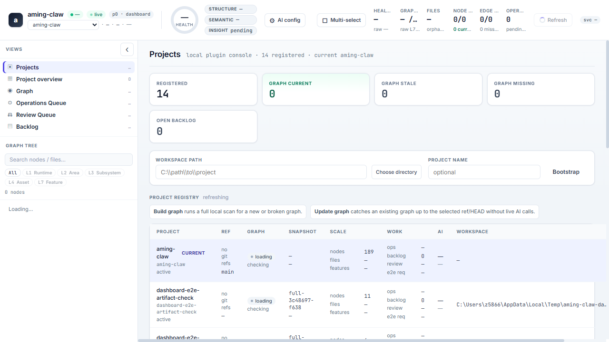
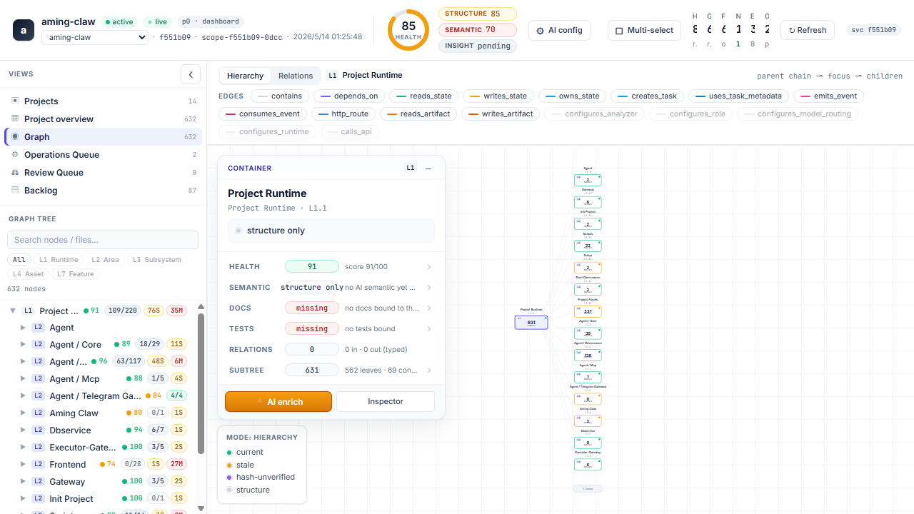
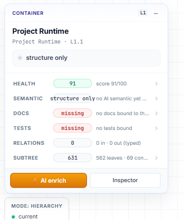
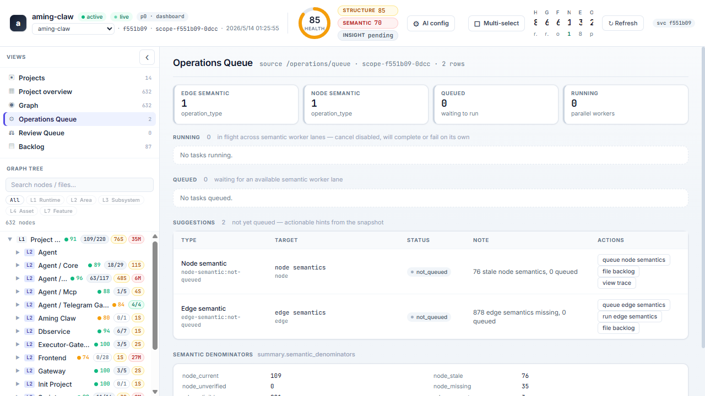
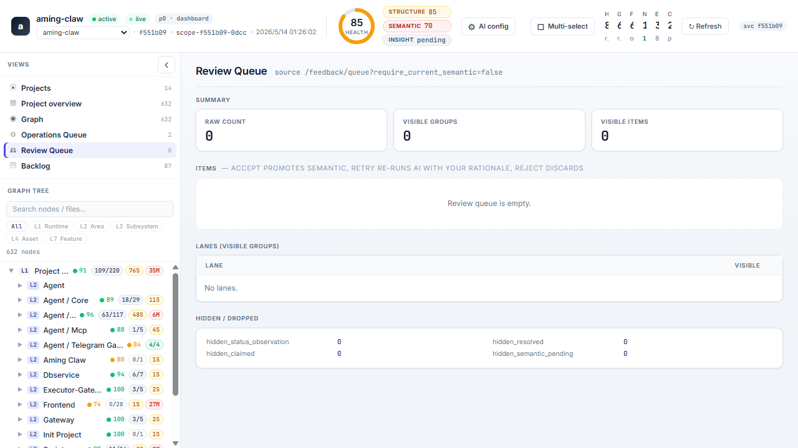

# Aming Claw

Aming Claw is a local AI governance workspace for turning a codebase into a
queryable graph, then using that graph to guide AI-assisted issue discovery,
backlog filing, and PR work.

The MVP is intentionally local-first: clone the repo, start the governance
service, load the Codex or Claude Code plugin from the cloned checkout, then use
the dashboard and MCP tools against your projects.

## Quick Start

Requirements:

- Python 3.9+
- Git
- Node.js/npm when rebuilding the dashboard from source
- Codex or Claude Code for the plugin/skill workflow

If you are starting from a plugin host, give it the repository URL:

```text
Install the Aming Claw plugin from https://github.com/amingclawdev/aming-claw
```

For Codex, this copy-paste prompt is the lowest-friction path when the
`aming-claw` command is not installed or is not on `PATH` yet:

```text
Please install Aming Claw from GitHub:
https://github.com/amingclawdev/aming-claw

If `aming-claw` is not available on PATH, run this Windows PowerShell bootstrap:
$installRoot="$env:USERPROFILE\.aming-claw\plugins"
$root=Join-Path $installRoot "aming-claw"
$dst="$env:TEMP\install_aming_claw.py"
Invoke-WebRequest https://raw.githubusercontent.com/amingclawdev/aming-claw/main/scripts/install_from_git.py -OutFile $dst
python $dst https://github.com/amingclawdev/aming-claw --install-root $installRoot

Run the read-only aftercare check:
cd "$root"
python -m agent.cli plugin doctor --plugin-root "$root" --skip-governance

Do not run `aming-claw start` or installer `--start` inline in Codex. It is a
long-running service command. Start it in a separate terminal/window:
Start-Process powershell -ArgumentList "-NoExit","-Command","cd `"$root`"; python -m agent.cli start"

Reload Codex or open a new Codex session after plugin install; the current
thread may not hot-load newly installed skills or MCP tools.

After install, open http://localhost:40000/dashboard, load the Aming Claw
skill/MCP, then check runtime_status, graph_status, and backlog before changing
code.
```

On macOS/Linux, the same raw installer can be run with:

```bash
curl -fsSL https://raw.githubusercontent.com/amingclawdev/aming-claw/main/scripts/install_from_git.py \
  -o /tmp/install_aming_claw.py
python3 /tmp/install_aming_claw.py https://github.com/amingclawdev/aming-claw
cd ~/.aming-claw/plugins/aming-claw
python3 -m agent.cli plugin doctor --plugin-root ~/.aming-claw/plugins/aming-claw --skip-governance
nohup python3 -m agent.cli start > ~/.aming-claw/aming-claw.log 2>&1 &
```

If an older Aming Claw runtime is already installed, update the plugin checkout
directly:

```bash
aming-claw plugin install https://github.com/amingclawdev/aming-claw
aming-claw plugin doctor
```

If the host cannot install Git plugins directly yet, clone once and use the
repo-local package:

```bash
git clone https://github.com/amingclawdev/aming-claw.git
cd aming-claw
pip install -e .
```

Then start governance in a separate terminal and leave it running:

```bash
aming-claw start
```

If the `aming-claw` console script is not on `PATH` yet, run the same CLI
through Python: `python -m agent.cli start`.

After installing or updating the plugin, reload Codex or open a new Codex
session. Plugin load and governance startup are separate: `aming-claw start`
only starts the local governance service, while the Codex plugin/skill/MCP
must be loaded by Codex itself.

Run the read-only aftercare check when troubleshooting a fresh install:

```bash
aming-claw plugin doctor
```

Expected checks:

- `.codex-plugin/plugin.json` exists.
- `.agents/plugins/marketplace.json` contains `aming-claw`.
- The marketplace `source.path` resolves to the Aming Claw plugin root.
- `.mcp.json` contains `mcpServers.aming-claw`.
- Governance health is reachable after services are started.
- A new Codex session can see the Aming Claw skill and MCP tools.

Open the local launcher or dashboard:

```bash
aming-claw launcher --open-browser
aming-claw open
```

Dashboard URL:

```text
http://localhost:40000/dashboard
```

## Load The Plugin

Aming Claw ships its plugin files inside this repository:

- `.codex-plugin/plugin.json`
- `.agents/plugins/marketplace.json`
- `.claude-plugin/plugin.json`
- `.claude-plugin/marketplace.json`
- `.mcp.json`
- `skills/aming-claw/`
- `skills/aming-claw-launcher/`

### Codex

Open the cloned `aming-claw` directory in Codex. The repo-local marketplace and
project `.mcp.json` provide the Aming Claw skill and MCP server contract.

In a new session, ask Codex to use the Aming Claw skill and check runtime state:

```text
Use the Aming Claw skill. Check runtime_status, graph_status, and backlog before changing code.
```

Codex does not auto-start Aming Claw services. Start them explicitly:

```bash
aming-claw start
```

`aming-claw start` is a foreground, long-running service command. Do not ask
Codex to wait for it as a one-shot task; run it in a separate terminal/window,
then return to Codex and verify with `runtime_status` or `aming-claw status`.

If the CLI is already available, it can update a local plugin checkout from the
public Git URL:

```bash
aming-claw plugin install https://github.com/amingclawdev/aming-claw
```

### Claude Code

From Claude Code, add the Git repository as a marketplace and install the
plugin:

```text
/plugin marketplace add https://github.com/amingclawdev/aming-claw
/plugin install aming-claw@aming-claw-local
```

If your Claude Code build does not support Git marketplace URLs yet, clone the
repo and add the local checkout instead:

```bash
git clone https://github.com/amingclawdev/aming-claw.git
cd aming-claw
pip install -e .
aming-claw start
```

```text
/plugin marketplace add /path/to/aming-claw
/plugin install aming-claw@aming-claw-local
```

The Claude plugin exposes the main governance skill and the launcher skill:

- `/aming-claw:aming-claw`
- `/aming-claw:aming-claw-launcher`

## Workflow

1. Clone and install Aming Claw.
2. Start the local governance service.
3. Load the Codex or Claude Code plugin.
4. Bootstrap or select a project in the dashboard.
5. Build or update the project graph.
6. Inspect nodes, files, functions, docs, tests, and relations.
7. Use AI Enrich on selected nodes or edges.
8. Review and accept or reject proposed semantic memory.
9. File backlog rows and PR opportunities with graph evidence.

## Dashboard

### Projects

Register projects, switch active workspaces, configure AI routing, and trigger
graph builds or updates.



### Graph

Explore the project structure, dependency relations, health, files, tests, docs,
and function indexes.



### AI Enrich

AI Enrich generates semantic summaries, intent, risk, and evidence for selected
nodes or edges. Generated semantics are not trusted memory until reviewed by an
operator.

Use selected-node or selected-edge enrichment first on large projects to control
cost and review scope.



Typical AI Enrich flow:

1. Select a graph node or edge.
2. Click `AI enrich`.
3. Watch the job in Operations Queue.
4. Review the proposed semantic memory.
5. Accept, reject, or retry.
6. Use accepted semantics for backlog and PR planning.

### Operations Queue

Track graph updates, semantic jobs, review work, and background operations.



### Review Queue

Review AI-generated semantic proposals before they become trusted project
memory.



## CLI

```bash
aming-claw launcher        # write/open the local launcher
aming-claw plugin install  # clone/update local plugin assets from Git
aming-claw start           # start governance locally
aming-claw open            # open the dashboard
aming-claw status          # check governance health
aming-claw bootstrap       # register a project workspace
aming-claw scan            # scan an external project
```

## Packaging

For MVP distribution, use Git rather than PyPI:

```bash
git clone https://github.com/amingclawdev/aming-claw.git
cd aming-claw
pip install -e .
```

For an already-installed Aming Claw CLI, refresh a user-local plugin checkout
from Git:

```bash
aming-claw plugin install https://github.com/amingclawdev/aming-claw
```

For a cloned checkout before the console script is on `PATH`, run the installer
through Python:

```bash
python scripts/install_from_git.py https://github.com/amingclawdev/aming-claw
```

Python-only installation from Git is also possible:

```bash
pip install git+https://github.com/amingclawdev/aming-claw.git
```

The Python-only path installs CLI entrypoints, but local plugin loading is
clearest from a cloned checkout because Codex and Claude Code need access to the
repo-local plugin manifests, skills, and `.mcp.json`.

Before publishing a release build, rebuild the dashboard assets:

```bash
npm --prefix frontend/dashboard run build
python scripts/build_package.py --skip-dashboard-build
```

## Governance Contract

When working on Aming Claw itself, follow the project governance contract:

1. Check runtime, graph, and queue state before implementation.
2. File or update a backlog row before mutating code, docs, config, dashboard
   assets, or runtime state.
3. Query the graph before creating new modules or changing behavior.
4. Follow `skills/aming-claw/references/mf-sop.md` for manual fixes.
5. Evaluate whether E2E evidence is needed for dashboard or graph behavior.

## Documentation

- [Architecture](docs/architecture.md)
- [Deployment](docs/deployment.md)
- [Governance Overview](docs/governance/README.md)
- [Configuration Reference](docs/config/README.md)
- [API Overview](docs/api/README.md)
- [Plugin Packaging Notes](skills/aming-claw/references/plugin-packaging.md)

## License

Aming Claw is licensed under the Functional Source License, Version 1.1, MIT
Future License (FSL-1.1-MIT). See [LICENSE](LICENSE).
